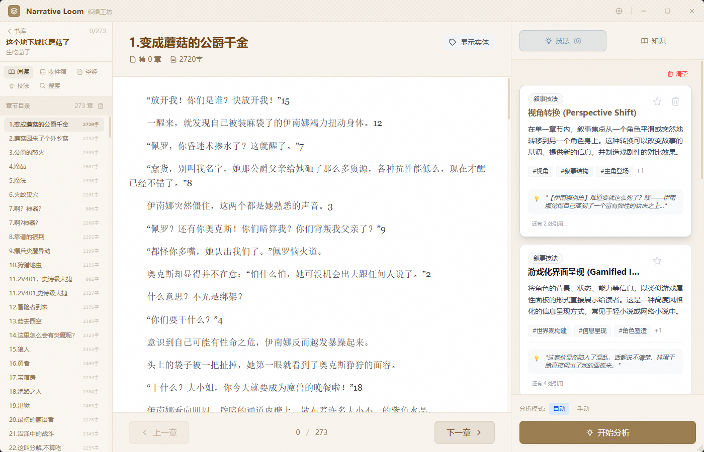
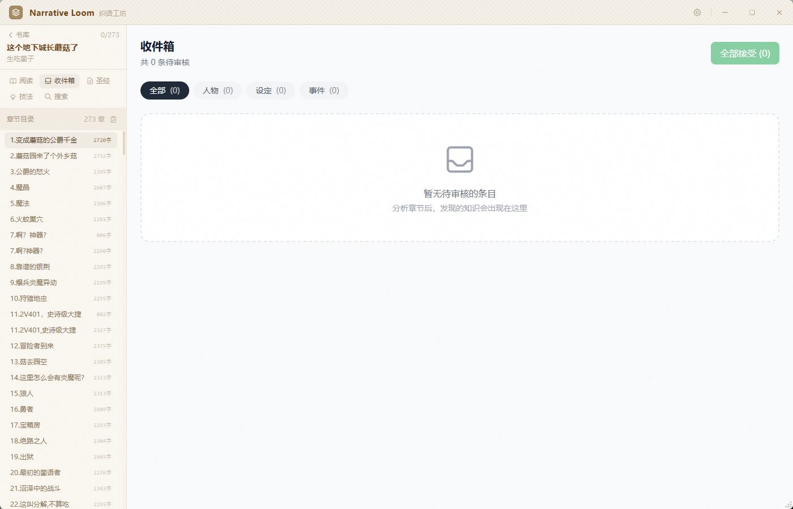
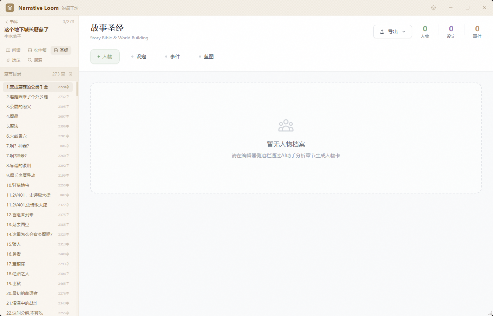
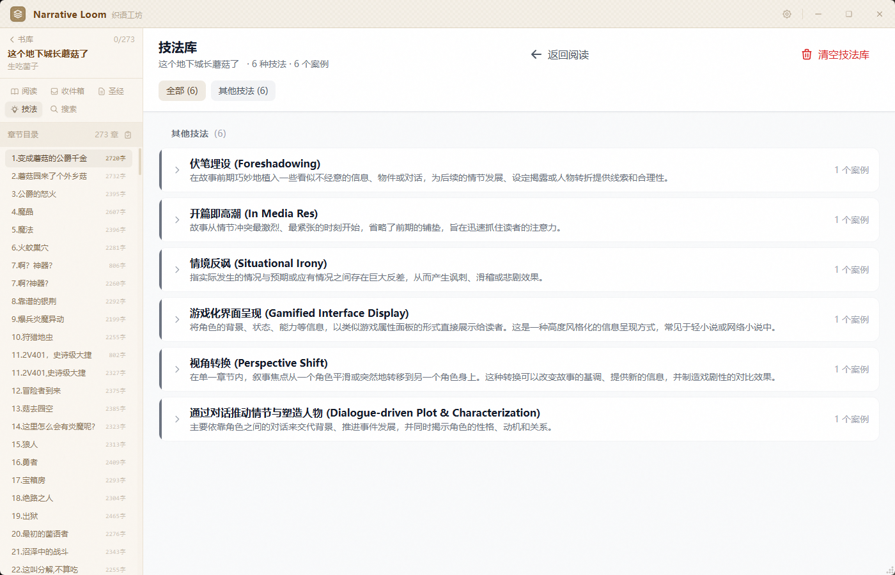
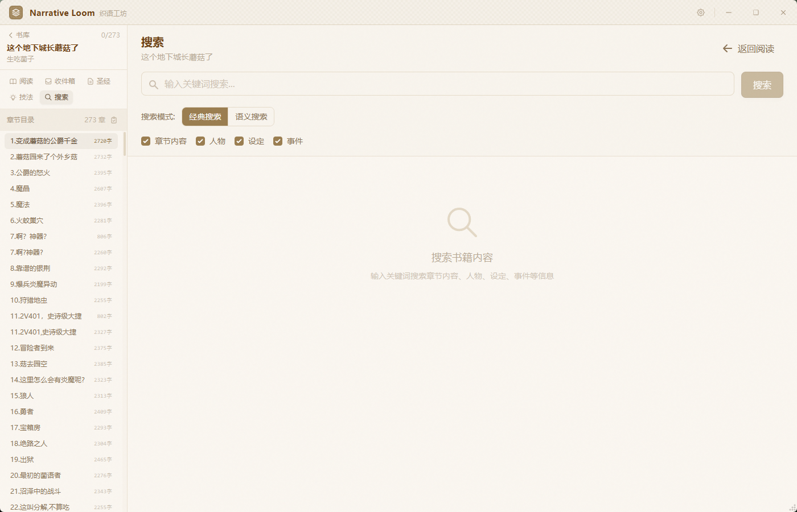
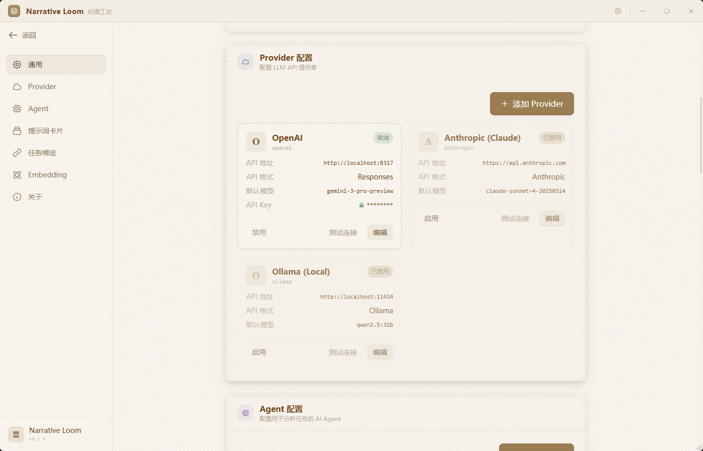

# Narrative Loom

Narrative Loom 是一个基于 `Tauri + Vue 3 + Rust + Python sidecar` 的本地桌面应用，用于导入长篇文本 / EPUB 小说，进行章节级 AI 分析，并将分析结果沉淀为可维护的写作知识库。

它当前不是通用聊天应用，而是围绕“小说阅读、拆解、整理、检索、复用”这条工作流构建的分析工具。

## 项目预览

### 主界面


### 工作界面

| 阅读 | 收件箱 |
|---|---|
|  |  |

| 故事圣经 | 技法库 |
|---|---|
|  |  |

| 搜索 | 设置 |
|---|---|
|  |  |

## 当前功能

### 书库与阅读

- 导入 `txt` 与 `epub` 文件到本地书库。
- 展示书籍统计信息，包括书籍数、章节数、字数。
- 进入单本书后支持章节目录导航、继续上次阅读章节、章节内容阅读。

### AI 章节分析

- 支持对单章执行多种分析任务：
  - `technique`：写作技法分析
  - `character`：人物抽取
  - `setting`：设定抽取
  - `event`：事件抽取
  - `style`：写作风格分析
- 支持批量分析多个章节，并通过 Tauri 事件实时回传进度。
- 风格分析支持读取当前风格档案做增量精炼。

### 收件箱与人工审核

- 人物 / 设定 / 事件分析结果先进入收件箱，支持人工审核。
- 支持单条接受、驳回、批量接受、带编辑接受、合并候选条目。

### 故事圣经（Story Bible）

- 管理人物、设定、事件三类实体。
- 支持结构化描述积累、关系信息、证据追踪、历史查看。
- 提供“蓝图”视图，包括时间线与关系图。

### 技法库

- 将章节中的技法分析结果整理为技法类型与案例库。
- 支持分类浏览、案例展开、跳转回章节、设置精选案例、删除案例。

### 搜索

- 支持经典搜索，覆盖：
  - 章节
  - 人物
  - 设定
  - 事件
- 支持语义搜索，并可切换：
  - `hybrid`
  - `vector`
  - `keyword`

### Provider / Agent / Prompt / Embedding 配置

- 设置页支持配置多个 LLM Provider。
- 支持 Agent 配置与任务绑定。
- 支持全局 Prompt Cards，按前置 / 后置方式叠加到系统提示词。
- 支持 Embedding Provider 配置与连接测试。
- 支持：
  - 书库路径
  - 日志开关
  - 自动接受阈值
  - 请求重试次数
  - 启用的分析 Agent

## 系统架构

项目当前采用四层结构：

- `Vue 3 + Pinia`
  负责界面、交互、状态管理。
- `Tauri`
  负责桌面应用壳、前后端桥接与事件通信。
- `Rust`
  负责命令入口、配置读取、数据库操作、上下文构建、向量检索、进度与持久化。
- `Python sidecar`
  负责 LLM provider 调用、结构化输出、分析执行。

主链路大致如下：

```text
Vue / Tauri UI
    ->
Rust commands
    ->
Python sidecar (python -m loom)
    ->
LLM providers
```

## 数据存储

Narrative Loom 的核心数据是本地优先的。

- 每本书拥有自己的 `book.db`
- 向量检索使用 `vectors.db`
- 章节正文已经迁移到 SQLite，而不是单独的 `.txt` 文件
- 书库列表由 `library.db` 管理
- API Key 通过系统 keychain 保存

## Prompt Cards

Prompt Cards 用于在不修改单个 Agent 配置的情况下，为所有分析任务注入全局系统提示词。

拼接顺序如下：

```text
[Prefix Cards...]
+ [Agent built-in system prompt]
+ [Suffix Cards...]
```

适用场景：

- 增加统一输出约束
- 增加全局免责声明
- 增加特定写作分析规则

## 开发环境

建议环境：

- Node.js 20+
- npm 10+
- Rust stable
- Python 3.10+

推荐 IDE：

- VS Code
- Vue - Official
- Tauri
- rust-analyzer

## 本地开发

### 1. 安装前端依赖

```bash
npm install
```

### 2. 安装 Python sidecar 依赖

任选一种方式：

```bash
cd python
pip install -r requirements.txt
```

或安装开发依赖：

```bash
cd python
pip install -e .[dev]
```

### 3. 启动应用

在项目根目录执行：

```bash
npm run tauri dev
```

Tauri 会先启动 Vite，然后由 Rust 侧按需拉起 Python sidecar。

## 常用验证命令

### 前端静态检查

```bash
npm run type-check
npm run lint
```

### Rust 检查

```bash
cd src-tauri
cargo check
cargo test -- --nocapture
```

### Python 检查

```bash
cd python
pytest -q
```

### 实体召回相关验证

在 `src-tauri` 目录执行：

```bash
cargo test retrieval:: -- --nocapture
cargo test entity_recall_context_integration -- --nocapture
cargo test entity_recall_metrics -- --nocapture
cargo check
```

## License

本项目采用 [MIT License](./LICENSE)。
